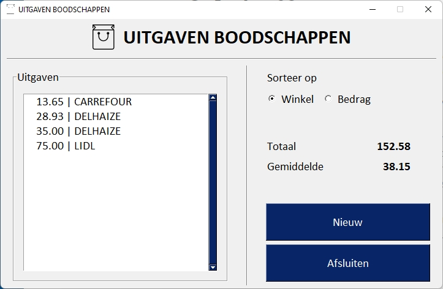
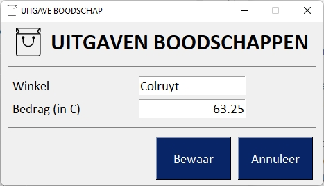
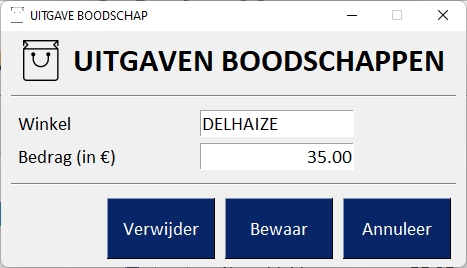
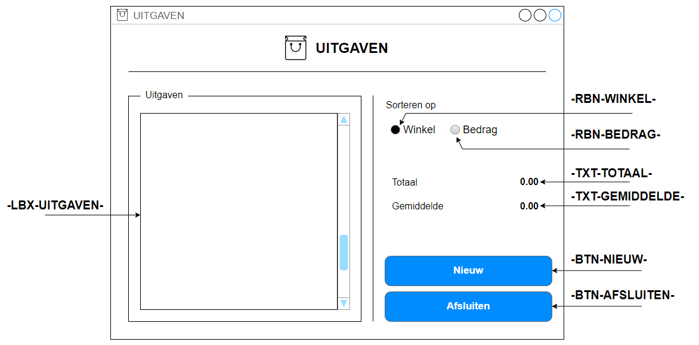
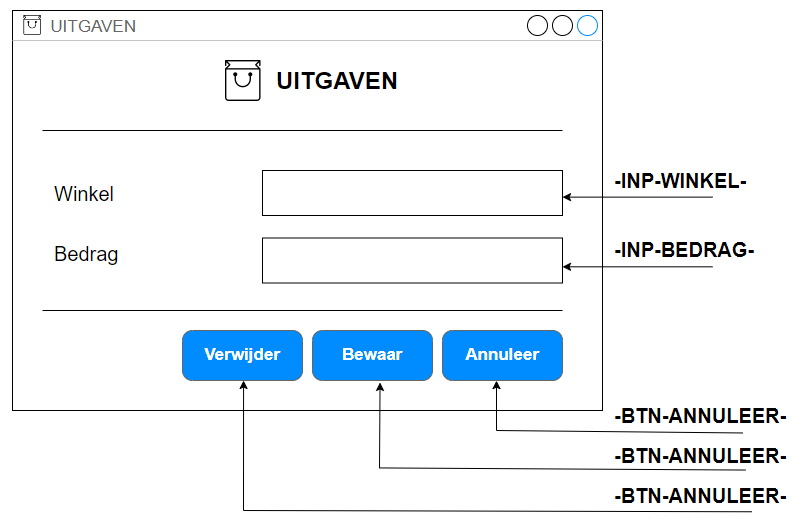

# Oefening 08

In dit project ligt de nadruk op entiteitklassen en het beheren van de gegevens in een JSON-bestand.

## Opdracht

Je opdracht bestaat eruit om een kleine applicatie te maken waarmee de gebruiker de uitgaven van boodschappen kan bijhouden.  Van elke boodschap verzamel je de naam van de winkel of supermarkt en het bedrag.  je applicatie berekent automatisch het totaal uitgegeven bedrag (de som van alle boodschappen) en het gemiddelde bedrag van de boodschappen.

De boodschappen kan je laten sorteren op 'winkel', de naam van de winkel of de supermarkt of op het bedrag.

Bij het opstarten van de applicatie wordt de Listbox gevuld met de geschiedenis van de aankopen.

De gebruiker kan een nieuwe boodschap invoeren

of een bestaande boodschap wijzigen of verwijderen.

## Structuur van het project

De structuur van het project staat hieronder afgebeeld.

``textile
│   main.py
│
├───app
│       app.py
│       app_layout.py
│       dlguitgave.py
│       dlguitgave_layout.py
│       init_layout.py
│
├───assets
│       favicon.ico
│       logo.png
│
├───bin
├───data
│       uitgaven.json
│
└───entiteit
        collectie.py
        uitgave.py
``

## Grafische gebruikersinterface

In de applicatie maken we gebruik van twee vensters.  De globale instellingen en de gemeenschappelijke elementen voor beide grafische gebruikersinterfaces  ken je toe aan het bestand `init_layout.py` (bevat o.a. het thema, lettertype, de kop van het venster, e.a...)

De klasse 'App' met de bestanden `app.py` en `app_layout.py` staan in voor het hoofdvenster.  Het hoofdvenster bestaat uit:

* kop van het venster, met logo en titel horizontaal gecentreerd

* de inhoud bestaat uit twee kolommen (`Column`-element)
  
  * de linker kolom bestaat uit:
    
    * een `Frame`-element met titel, met daarin een `Listbox`-element, grootte 30x12.  Ken aan de Listbox een padding van 15x15 toe.  Ken aan het attribuut 'key' van de Listbox '-LBX-UITGAVEN-' toe.  Met het attribuut `enable_events` zorg je ervoor dat een gebeurtenis getriggerd wordt wanneer de gebruiker op een item in de Listbox klikt.
  
  * de rechter kolom: 
    Zorg dat deze kolom de maximale hoogte inneemt.  Gebruikr hiertoe de eigenschap `expand_X`.
    Deze kolom bestaat uit:
    
    * RIJ 1  
      bestaat uit een `Text`-element met inhoud 'Sorteer op'
    
    * RIJ 2  
      bestaat uit twee `Radio`-elementen, radiobuttons met respectievelijke 'key' '-RBN-WINKEL-' en '-RBN-BEDRAG-'.  Ook nu, wanneer de gebruiker de andere radiobutton selecteert moet een event getriggered worden ('enable_events).  Zet de eerste radiobutton standaard actief (geselecteerd).
    
    * RIJ 3  
      aan deze rij ken je een `VPush`-element toe
    
    * RIJ 4 en RIJ 5  
      bestaan elk uit twee `Text`-elementen, eentje voor de label en eentje voor de hoeveelheid:
      
      * aan label, het eerste `Text`-element op de rij, ken je 12x1 toe als afmetingen
      
      * aan hoeveelheid, het tweede `Text`-element op de rij, ken je 10x1 toe als grootte, rechts uitgelijnd, tekst vet.  Ken aan het 'key'-attribuut van de respectievelijke elementen '-TXT-TOTAAL-' en '-TXT-GEMIDDELDE-' toe.
    
    * RIJ 6  
      Ook aan deze rij ken je een `VPush`-element toe
    
    * RIJ 7 en RIJ 8  
      beide rijen bevatten een `Button`-element.  Ken aan het 'key'-attribuut r(espectievelijk) de waarde '-BTN-NIEUW-' en '-BTN-AFSLUITEN-' toe.  Knopgrootte 26x2

Voor het detailvenster zijn de bestanden `dlguitgave.py` en `dlguitgave_layout.py` verantwoordelijk.  Dit venster bestaat enkel uit rijen:

* RIJ 1  
  kop van het venster, met logo en titel horizontaal gecentreerd

* RIJ 2 en RIJ 5   
  bestaat uit een `HorizontalSeparator` met verticale padding 10

* RIJ 3 en RIJ4   
  
  * label: een `Text`-element met grootte 17x1
  
  * tekstveld: `INPUT`-element met grootte 15x1.  Ken aan het attribuut 'key' '-INP-WINKEL-' respectievelijke '-INP-BEDRAG-' toe.  Lijn de inhoud van het tweede tekstveld rechts uit

* RIJ 6  
  bestaat uit drie knoppen, `Button`-elementen.  Ken aan alle drie knoppen de grootte 10x2 toe.  Ken aan het 'key'-attribuut van de knoppen vervolgens '-BTN-VERWIJDER-', '-BTN-BEWAAR-' en '-BTN-ANNULEER-'.

## Entiteitklassen

Voor deze toepassing maak je gebruik van twee entiteitsklassen:

* 'Uitgave'  
  deze klasse is verantwoordelijk voor het beheren van de gegevens van één enkele boodschap

* 'Collectie'   
  deze objectcontainer is verantwoordelijk voor het beheren van uitgaven, insnaties van de klasse 'Uitgave'.

**De klasse 'Uitgave'**

De klasse houdt volgende gegevens bij (eigenschappen):

* `_sorteerMode`  
  de manier waarop de elementen in de Listbox gesorteerd weergegeven worden;  Wanneer een nieuwe instantie van de klasse wordt aangemaakt wordt standaard 'WINKEL' aan deze eigenschap toegekend

* `_winkel`  
  met de naam van de betreffende winkel of supermarkt

* `_bedrag`  
  met het totaal van de boodschappen

Verder onderscheiden we volgende mathoden:

* `__init__(self, winkel:str = '', bedrag:float = 0.0)`  
  de constructor van de klasse.  ken de inhoud van de parameters toe aan de respectievelijke eigenschappen.

* `sorteer(self, _sorteerMode:str)`  
  voor het zetten van de sorteer mode maak je gebruik van de methode `sorteer()`.      De inhoud van de parameter ken je toe aan de corresponderende eigenschap

* getter | setter `winkel`  
  
  * `winkel(self)`  
    maak - voor het ophalen van de inhoud van de eigenschap - gebruik van getter-methode met behulp van `@property`
  
  * `winkel(self, winkel:str)`  
    voor het toekennen van een nieuwe waarde aan de eigenschap `_winkel`, maak je gebruik van een setter-methode met `@winkel.setter`  
    Zorg ervoor dat de naam van de winkel nooit spaties vooraan en achteraan heeft en dat de naam steeds in hoofdletters staat.  
    Kijk erop toe dat de naam van de winkel verplicht is (mag niet leeg zijn)

* getter | setter `bedrag`
  
  * `bedrag(self)`   
    ook voor het ophalen van de inhoud van de eigenschap `_bedrag` maak je gebruik van een getter-methode met `@property`
  
  * `bedrag(self, bedrag:str)`
    voor het wijzigen van de inhoud van de eigenschap `_bedrag` maak je gebruik van een setter-methode met `@bedrag.setter`.  
    Het bedrag - afkomstig van het formulier uit 'DlgUitgave' is van het type string.  Om fouten bij het converteren van string naar decimaal getal te voorkomen verwijder je steeds spaties  en een de decimale punt voor of achteraan het bedrag.  Zo bijvoorbeeld zet je 12. om in 12, maar 12.15 blijft 12.15.  Voordat je de waarde omzet naar een float valideer je met een reguliere expressie of de inhoud van de string voldoet aan het patroon van een decimaal getal.

* `__str__(self)`  
  deze magische methode voorzie je voor weergave in de Listbox.  Het patroon blijft hetzelfde, onafhankelijk van de sorteer methode en bestaat steeds uit het bedrag gevolgd door de naam van de winkel.  Zorg ervoor dat het bedrag steeds als een decimaal getal met twee cijfers na de komma wordt weergegeven en steeds 10 cijfers inneemt.

* verglijken  
  voorzie de magische methoden om twee objecten met elkaar te vergelijken.  Het vergelijk van twee objecten is sorteer methode afhankelijk  
  Declareer een mgaische methode voor 'groter dan', 'groter of gelijk aan', 'kleiner dan', 'kleiner of gelijk aan' en 'gelijk aan'.

* `__repr__()`  
  voorzie de magische methode `__repr__()`  zodat je een string genereert waarmee je identiek hetzelfde object (instantie van de klasse 'Uitgave) kunt maken.

**Klasse 'Collectie'**  

De klasse collectie is een objectencontainer en beheert geen, één of meerdere objecten, instanties van de klasse 'Uitgave'.  Het verzorgd onder andere de CRUD-methodologie (Create Read Update Delete).

Eigenschappen van de klasse:

* `_uitgaven`   
  een list waarin alle objecten, instanties van de klasse 'Uitgave'  verzameld worden.

Ken aan deze klasse volgende eigenschappen toe:

* `__init__(self)`   
  de constructor van de klasse, verantwoordelijk voor het opzetten van de eigenschap `_uitgaven_` en het uitlezen van het JSON-bestand met de geschiedenis van de aankopen.  Van elke aankoop, boodschap wordt een nieuwe instantie van de klasse 'Uitgave' gemaakt en toegevoegd aan `_uitgaven_`

* `nieuw(self)`  
  levert een nieuwe instantie van de klasse 'Uitgave' aan

* `update(self, oUitgave:Uitgave, winkel:str='', bedrag:str='0.0')`  
  deze methode wordt aangeroepen vanuit 'DlgUitgave' met volgende parameters:
  
  * `oUitgave`  
    met het up te daten object (instantie van de klasse 'Uitgave)
  
  * `winkel`  
    de naam van de winkel of supermarkt
  
  * `bedrag`   
    met het totaal bedrag van de inkoop
  
  Bij het uitvoeren van deze methode wordt eerst gecontroleerd of het object `oUitgave` voorkomt in `_uitgaven_`.  In het geval dat de gebruiker op 'Nieuw' klikt, is dit niet het geval en voeg je het object eerste toe aan `_uitgaven_`.  
  Daarna ken je aan het object de nieuwe waarden toe

* `verwijder(self, oUitgave:Uitgave)`  
  deze methode staat in voor het verwijderen van het meegegeven object `oUitgave` uit `_uitgaven_`.  Controleer eerst of he object in `_uitgaven_` voorkomt.

* `totaal(self)`  
  deze methode levert de som van de bedragen van de onderscheiden aankopen

* `gemiddelde(self)`  
  deze methode levert het gemiddelde  van de bedragen van de onderscheiden aankopen.  
  Maak voor deze methode gebruik van `mean()` uit de module `statistics`.  Om het gemiddelde te berekenen haal je van elke boodschap het bedrag op, ken ze toe aan een list (bijvoorbeeld de list 'bedragen') en bereken je het rekenkundig gemiddelde met `mean(bedragen).  
  Rond het gemiddelde af op twee cijfers na de komma.`

* `lijst(self)`  
  deze methode wordt aangeroepen voor het vullen van de Listbox en levert de inhoud van de eigenschap `_uitgaven_`

* `sorteer(self, sorteerMode:str)`  
  deze methode roept van elk object in `_uitgaven_` de methode `sorteer()` aan en geeft de parameter `sorteerMode` mee.  
  Daarna vervang je de inhoud van de eigenschap `_uitgaven` met de gesorteerde lijst `_uitgaven`

* `bewaar(self)`  
  de methode `bewaar()` staat in voor het opslaan van de objecten in de list `_uitgaven` in het JSON-bestand.
