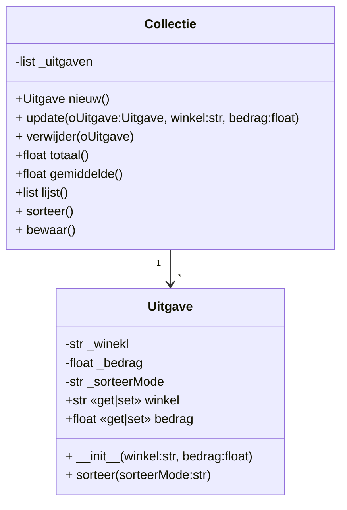

```mermaid
classDiagram
    class Collectie {
        -list _uitgaven
        +Uitgave nieuw()
        + update(oUitgave:Uitgave, winkel:str, bedrag:float)
        + verwijder(oUitgave)
        +float totaal()
        +float gemiddelde()
        +list lijst()
        + sorteer()
        + bewaar()
    }

    class Uitgave {
        -str _winekl
        -float _bedrag
        -str _sorteerMode
        +str «get|set» winkel
        +float «get|set» bedrag
        + \_\_init\_\_(winkel:str, bedrag:float)
        + sorteer(sorteerMode:str)

    }

    Collectie "1" --> "*" Uitgave
```